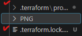
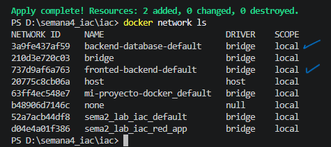
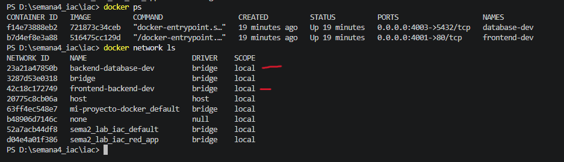
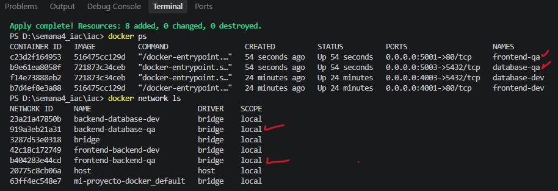

# Terraform Hands-on Lab

## Configuración Inicial

### El proyecto utiliza el proveedor oficial de Docker mantenido por Kreuzwerker y la version 4.6.0 .

 Terraform leerá el archivo providers.tf.

Descargará el proveedor kreuzwerker/docker versión 4.6.0.

 Creará una carpeta oculta .terraform y un archivo .terraform.lock.hcl.

## Mapeo de puertos 
| Entorno | Frontend |   Backend | PostgreSQL |
| ------- | -------: | --------: | ---------: |
| DEV     |  4001:80 | 4002:3000 |  4003:5432 |
| QA      |  5001:80 | 5002:3000 |  5003:5432 |

## Definir redes
frontend-backend-dev

backend-database-dev

frontend-backend-qa

backend-database-qa

### Por default

#### Esto también evita que DEV y QA terminen hablando entre sí.

## Desarrollo y conexion  de frontend , backend y base de datos

### despliegue dev

### despliegue qa
